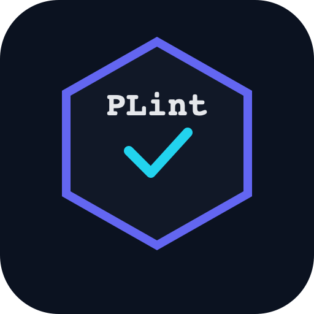

# PromptLint - AI Prompt Refactoring Tool

<p align="center">
  
</p>

<p align="center">
  <strong>Write better prompts, get better AI responses! Instantly transform rough ideas into polished, structured prompts that unlock the full power of ChatGPT, Claude & LLMs.</strong>
</p>

<p align="center">
  <a href="https://marketplace.visualstudio.com/items?itemName=SantanSharma.promptlint">
    
  </a>
  <a href="https://marketplace.visualstudio.com/items?itemName=SantanSharma.promptlint">
    
  </a>
  <a href="https://marketplace.visualstudio.com/items?itemName=SantanSharma.promptlint">
    
  </a>
</p>

---

## ✨ What is PromptLint?

**PromptLint** is a VS Code extension that helps you write better prompts for AI systems like ChatGPT, Claude, and other LLMs. It takes your rough, unstructured prompts and transforms them into clear, well-organized prompts that get better results.

### 🎯 Key Features

- **One-Click Refactoring** - Select any text and instantly improve it
- **Interactive Panel** - Dedicated UI for writing and refining prompts
- **Multiple Output Options** - Replace text, open in new tab, or copy to clipboard
- **Context Menu Integration** - Right-click to refactor selected text
- **Supports Multiple LLMs** - Works with OpenAI, Claude, and compatible APIs

---

## 📸 Screenshots

### Interactive Prompt Editor Panel


### Right-Click Context Menu


---

## 🚀 Getting Started

### Installation

1. Open VS Code
2. Go to Extensions (`Cmd+Shift+X` / `Ctrl+Shift+X`)
3. Search for **"PromptLint"**
4. Click **Install**

### Setup Your API Key

1. Open VS Code Settings (`Cmd+,` / `Ctrl+,`)
2. Search for **"PromptLint"**
3. Enter your OpenAI API key in the **Api Key** field
4. (Optional) Change the model or endpoint


> 💡 **Tip**: Get your API key from [OpenAI Platform](https://platform.openai.com/api-keys)

---

## 📖 How to Use

### Method 1: Interactive Panel

1. Press `Cmd+Shift+P` (Mac) or `Ctrl+Shift+P` (Windows/Linux)
2. Type **"PromptLint: Open Prompt Editor Panel"**
3. Enter your rough prompt in the text area
4. Click **"✨ Refactor Prompt"**
5. Copy the improved prompt!

### Method 2: Refactor Selected Text

1. Select any text in your editor
2. Either:
   - Press `Cmd+Shift+P` → **"PromptLint: Refactor Selected Prompt"**
   - Or **Right-click** → **"PromptLint: Refactor Selected Prompt"**
3. Choose where to output:
   - **Replace Selection** - Replaces the selected text
   - **Open in New Tab** - Creates a new file with the result
   - **Copy to Clipboard** - Copies for pasting elsewhere

---

## ⚙️ Configuration

| Setting | Default | Description |
|---------|---------|-------------|
| `promptlint.apiKey` | `""` | Your OpenAI or Claude API key |
| `promptlint.apiEndpoint` | `https://api.openai.com/v1/chat/completions` | API endpoint URL |
| `promptlint.model` | `gpt-4` | Model to use (e.g., `gpt-4o-mini`, `gpt-4-turbo`) |
| `promptlint.maxTokens` | `2048` | Maximum tokens for responses |

### Using with Claude

To use with Anthropic's Claude:

```json
{
  "promptlint.apiEndpoint": "https://api.anthropic.com/v1/messages",
  "promptlint.model": "claude-3-sonnet-20240229"
}
```

---

## 🔄 Example

### Before (Raw Prompt)
```
write code for login
```

### After (Refactored by PromptLint)
```
# Role
You are an expert software developer specializing in authentication systems.

# Task
Create a secure user login implementation with the following requirements:

## Requirements
- User authentication with email/username and password
- Input validation and sanitization
- Secure password handling (hashing)
- Session management
- Error handling for invalid credentials

## Constraints
- Follow security best practices (OWASP guidelines)
- Include comments explaining the code
- Handle edge cases gracefully

## Output Format
Provide the complete code with:
1. Required imports/dependencies
2. Main login function
3. Helper functions
4. Example usage

Please specify the programming language/framework you'd like me to use.
```

---

## 🛠️ Commands

| Command | Description |
|---------|-------------|
| `PromptLint: Open Prompt Editor Panel` | Opens the interactive prompt editor |
| `PromptLint: Refactor Selected Prompt` | Refactors the currently selected text |

---

## ❓ FAQ

**Q: Which LLM models are supported?**  
A: Any OpenAI-compatible API (GPT-4, GPT-3.5, Claude, etc.)

**Q: Is my API key secure?**  
A: Yes, it's stored in VS Code's secure settings storage

**Q: Why am I getting "Rate limit exceeded"?**  
A: Your API key has hit its usage limit. Check your OpenAI dashboard or try a different model like `gpt-4o-mini`

**Q: Can I use this offline?**  
A: No, it requires an internet connection to reach the LLM API

---

## 📝 Changelog

See [CHANGELOG.md](CHANGELOG.md) for version history.

---

## 🤝 Contributing

Contributions are welcome! Please feel free to submit a Pull Request.

1. Fork the repository
2. Create your feature branch (`git checkout -b feature/AmazingFeature`)
3. Commit your changes (`git commit -m 'Add some AmazingFeature'`)
4. Push to the branch (`git push origin feature/AmazingFeature`)
5. Open a Pull Request

---

## 📄 License

This project is licensed under the MIT License - see the [LICENSE](LICENSE) file for details.

---

## 👨‍💻 Author

**Santan Sharma**

- GitHub: [@SantanSharma](https://github.com/SantanSharma)
- Email: [santansh47@gmail.com](mailto:santansh47@gmail.com)

---

## ⭐ Support

If you find PromptLint helpful, please:
- ⭐ Star the repository
- 📝 Leave a review on the VS Code Marketplace
- 🐛 Report issues on GitHub

---

<p align="center">
  Made with ❤️ by Santan Sharma
</p>
